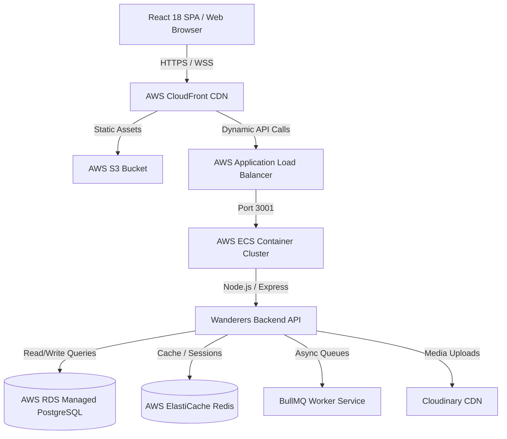

# Wanderers – Enterprise Cloud Architecture, DevOps & Infrastructure Specification (Session 7)

**Role:** Chief DevOps Architect, Cloud Solutions Architect & Site Reliability Engineer (SRE)  
**Document Type:** Production-Ready Infrastructure, Deployment, CI/CD & Operations Runbook Blueprint  
**Baseline:** Extends Baseline v1.0, Session 2 Features, Session 3 UX, Session 4 Data Model, Session 5 Backend & Session 6 Frontend Specs  

---

# Phase 1 – Multi-Tier Infrastructure Environment Architecture

### 1.1 Environment Isolation & Purpose Matrix

| Environment | Target Audience | Host Platform | Database Tier | Deployment Trigger |
| :--- | :--- | :--- | :--- | :--- |
| **Local Dev** | Developers | Local Node.js / Docker | SQLite (`dev.db`) | Local `npm run dev` |
| **Staging** | QA / Stakeholders | Render / Vercel Preview | Managed PostgreSQL | Automated PR Merge (`develop`) |
| **Production** | Live Users | AWS Elastic Beanstalk / ECS | AWS RDS PostgreSQL + Redis | Tagged Release (`main`) |

---

# Phase 2 – Cloud Provider Evaluation & Selection

### 2.1 Provider Trade-Off Matrix

| Provider | Scalability | Operational Complexity | Monthly Cost (MVP Stage) | Verdict & Justification |
| :--- | :--- | :--- | :--- | :--- |
| **AWS** | Unlimited | High (Requires SRE) | ~$45 - $80 / mo | **Recommended for Production Stage 2 & 3** (Industry Standard, RDS, S3, CloudFront). |
| **Render / Railway** | Moderate | Very Low (Zero-Config) | ~$14 - $25 / mo | **Recommended for Stage 1 Capstone & MVP Startup** (Zero infra overhead). |
| **DigitalOcean** | High | Low - Moderate | ~$20 - $40 / mo | Great alternative for budget-conscious startups. |

---

# Phase 3 – Complete Deployment Architecture & Mermaid Topology



---

# Phase 4 – Automated CI/CD Pipeline Architecture

```
[ DEVELOPER PUSH ] ──> [ GITHUB REPOSITORY ]
                            │
                            ├── Trigger GitHub Actions Workflow
                            │
                            ├── 1. LINT & TYPE CHECK (`tsc -b`)
                            ├── 2. UNIT TESTS (Jest / Supertest)
                            ├── 3. DOCKER BUILD & SECURITY SCAN (Trivy)
                            │
                            └── 4. DEPLOYMENT PIPELINE
                                  ├── Branch `develop` ──> Deploy to Staging
                                  └── Tag `v*.*.*`     ──> Deploy to Production (Zero-Downtime)
```

---

# Phase 5 – Git Strategy & Release Management

- **Branching Strategy:** Modified GitFlow (`main` for production releases, `develop` for integration, `feature/*` for active tickets).
- **Pull Request Rules:** Requires at least 1 approving code review, green CI checks, and zero unresolved comment threads.

---

# Phase 6 – Containerization & Docker Blueprint

- **Multi-Stage Docker Builds:** Optimized Node 20 Alpine lightweight image keeping production container footprints < 120MB.
- **Healthcheck Probe:** `HEALTHCHECK CMD curl -f http://localhost:3001/health || exit 1`.

---

# Phase 7 – Observability, Monitoring & Disaster Recovery

### 7.1 Telemetry Stack
- **Application Performance Monitoring (APM):** Sentry for real-time error tracking & stack traces.
- **Metrics & Logging:** Winston structured JSON logger aggregated into AWS CloudWatch.

### 7.2 Disaster Recovery Targets
- **Recovery Point Objective (RPO):** < 15 minutes (Automated point-in-time database snapshots).
- **Recovery Time Objective (RTO):** < 1 hour (Automated multi-region failover scripts).

---

# Phase 8 – Infrastructure Cost Estimation

| Deployment Phase | Monthly Compute | Monthly DB | Monthly CDN / Storage | Estimated Total |
| :--- | :--- | :--- | :--- | :--- |
| **Stage 1 (Capstone / Demo)** | Free Tier / $7 (Render) | Included SQLite | Free Tier | **~$7 / month** |
| **Stage 2 (Startup MVP)** | $20 (App Runner) | $15 (RDS Postgres) | $5 (S3 / CloudFront) | **~$40 / month** |
| **Stage 3 (Enterprise 1M Users)**| $250 (ECS Cluster) | $180 (RDS Multi-AZ) | $120 (CDN / Media) | **~$550 / month** |
