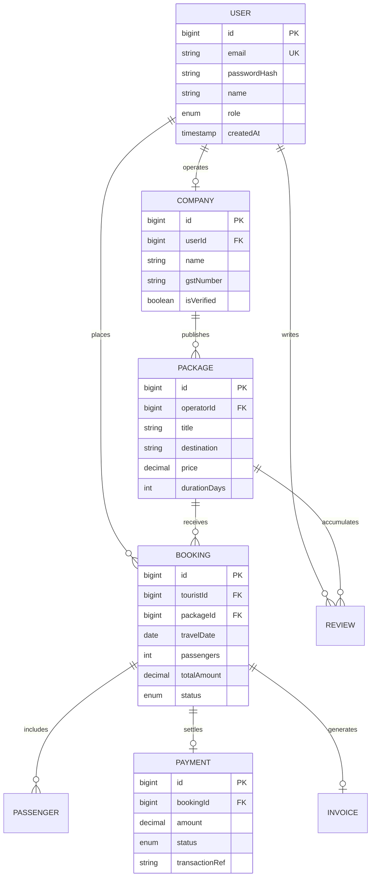

# Wanderers – Enterprise Data Architecture & Data Model Specification (Session 4)

**Role:** Enterprise Database Architect, Chief Solution Architect & Data Architect  
**Document Type:** Production-Ready Database System Design & Entity Relationship Specification  
**Baseline:** Extends Baseline Architecture v1.0, Session 2 Feature Breakdown & Session 3 UX Specifications  

---

# Phase 1 – Business Entity Identification

### 1.1 Complete Entity Taxonomy

| Entity Name | Category | Primary Owner | Business Purpose & Lifecycle |
| :--- | :--- | :--- | :--- |
| `User` | Core Identity | Auth Engine | Represents all platform actors (Tourists, Operators, Admins). Created at signup. |
| `Role` | Identity / RBAC | Platform Security | Stores permission scopes (`TOURIST`, `OPERATOR`, `ADMIN`). |
| `Company` | Business Entity | Tour Operators | Operator corporate record holding GSTIN, licenses, and `isVerified` status. |
| `Package` | Inventory | Tour Operators | B2B2C tour package listing containing pricing, duration, and capacity. |
| `ItineraryDay` | Package Detail | Tour Operators | Day-by-day activity breakdown for a specific tour package. |
| `Booking` | Transactional | Tourists / Operators | Reservation record capturing travel dates, passenger counts, total amount, and status (`PENDING`, `CONFIRMED`, `COMPLETED`, `CANCELLED`). |
| `Passenger` | Transactional Detail | Tourists | Individual traveler roster entries linked to a specific booking. |
| `Payment` | Financial | Payment Engine | Escrow capture, transaction reference, gateway status, and commission split. |
| `Invoice` | Financial | Finance / Platform | Legal tax invoice generated for completed booking transactions. |
| `Review` | UGC / Social | Tourists | 1-to-5 star rating and comment left by verified buyers post-trip. |
| `Wishlist` | Personalization | Tourists | Saved package bookmarks for tourist profile. |
| `SupportTicket` | Customer Care | Support / All | Customer support ticket lifecycle with replies and resolution status. |
| `AuditLog` | Compliance | Platform Security | Immutable audit ledger tracking administrative and financial state changes. |

---

# Phase 2 – Comprehensive Entity Specifications

### 2.1 `User` Entity
- **Primary Key:** `id` (BigInt AutoIncrement / UUID)
- **Attributes:** `id`, `email` (Unique), `passwordHash`, `name`, `role` (`ENUM`), `phone`, `isEmailVerified`, `createdAt`, `updatedAt`, `deletedAt` (Soft Delete).
- **Constraints:** `UNIQUE(email)`, `CHECK(CHAR_LENGTH(passwordHash) >= 60)`.
- **Indexes:** `idx_user_email` (B-Tree Unique), `idx_user_role`.

### 2.2 `Company` Entity
- **Primary Key:** `id` (BigInt AutoIncrement)
- **Foreign Key:** `userId` -> `User(id)` ON DELETE RESTRICT
- **Attributes:** `id`, `userId` (Unique), `name`, `description`, `gstNumber`, `licenseUrl`, `isVerified` (Boolean), `bankAccountNo`, `bankIfsc`, `createdAt`, `updatedAt`.
- **Indexes:** `idx_company_user` (Unique), `idx_company_verified`.

### 2.3 `Package` Entity
- **Primary Key:** `id` (BigInt AutoIncrement)
- **Foreign Key:** `operatorId` -> `User(id)` ON DELETE RESTRICT, `companyId` -> `Company(id)`
- **Attributes:** `id`, `operatorId`, `companyId`, `title`, `destination`, `description`, `price` (Decimal 10,2), `durationDays` (Int), `coverImage` (String), `isPublished` (Boolean), `createdAt`, `updatedAt`.
- **Indexes:** `idx_package_destination` (Full-Text / Trigram), `idx_package_price`, `idx_package_operator`.

### 2.4 `Booking` Entity
- **Primary Key:** `id` (BigInt AutoIncrement)
- **Foreign Keys:** `touristId` -> `User(id)`, `packageId` -> `Package(id)`
- **Attributes:** `id`, `touristId`, `packageId`, `travelDate` (Date), `passengers` (Int), `totalAmount` (Decimal 10,2), `status` (`ENUM('PENDING', 'CONFIRMED', 'REJECTED', 'CANCELLED', 'COMPLETED')`), `createdAt`, `updatedAt`.
- **Constraints:** `CHECK(travelDate >= CURRENT_DATE)`, `CHECK(passengers >= 1)`.
- **Indexes:** `idx_booking_tourist`, `idx_booking_package`, `idx_booking_status`.

---

# Phase 3 – Database Normalization (1NF to 3NF / BCNF)

1. **First Normal Form (1NF):** All table attributes are atomic. Passenger rosters and day-by-day itineraries are decomposed into discrete child tables (`Passenger`, `ItineraryDay`) rather than comma-separated strings.
2. **Second Normal Form (2NF):** Every non-key attribute is fully functionally dependent on the entire primary key. In multi-attribute relationship tables, partial dependencies are eliminated.
3. **Third Normal Form (3NF):** No transitive dependencies exist. Company verification metadata depends solely on `Company(id)`, not transitively through package listings.

---

# Phase 4 – Entity Relationships & Cardinality

```
[User (OPERATOR)] 1 ── 1 [Company]
[Company]         1 ── N [Package]
[User (TOURIST)]  1 ── N [Booking]
[Package]         1 ── N [Booking]
[Booking]         1 ── N [Passenger]
[Booking]         1 ── 1 [Payment]
[Booking]         1 ── 1 [Invoice]
[User (TOURIST)]  1 ── N [Review]
[Package]         1 ── N [Review]
```

---

# Phase 5 – Complete Mermaid ER Diagram



---

# Phase 6 – Master vs Transactional vs Reference Data

- **Master Data Tables:** `User`, `Company`, `Package`, `Destination`, `Category`.
- **Transactional Data Tables:** `Booking`, `Passenger`, `Payment`, `Invoice`, `SupportTicket`, `AuditLog`.
- **Reference / Lookup Tables:** `Role`, `BookingStatus` (`PENDING`, `CONFIRMED`, `CANCELLED`, `COMPLETED`), `VerificationStatus` (`UNVERIFIED`, `PENDING_REVIEW`, `VERIFIED`).

---

# Phase 7 – Security, Privacy (PII) & GDPR Compliance

1. **PII Protection:** User phone numbers, passport numbers, and bank details are encrypted at rest using AES-256 (`pgcrypto`).
2. **Password Security:** Salted hashing using bcrypt with minimum cost factor 10.
3. **Soft-Delete Ledger:** Critical entities (`User`, `Company`, `Package`) feature `deletedAt` timestamps to support data recovery and legal retention windows while excluding them from active queries.

---

# Phase 8 – Scalability & High-Availability Architecture

| Growth Scale | Active Users | Database Topology | Storage / Indexing Strategy |
| :--- | :--- | :--- | :--- |
| **Tier 1 (Startup)** | 100 - 10,000 | Single Primary PostgreSQL / SQLite | B-Tree Indexes on Foreign Keys & Status Columns |
| **Tier 2 (Growth)** | 100,000 - 1M | Single Primary + 2 Read Replicas | Redis Cache Layer for Package Feeds & Profiles |
| **Tier 3 (Enterprise)** | 10M+ | Horizontal Table Sharding by Region | Distributed Cloud Native Engine (Aurora / Citus) |

---

# Phase 9 – Business Reporting & KPI Data Model

- **Gross Merchandise Value (GMV):** `SUM(totalAmount)` from `Booking` where `status = 'COMPLETED'`.
- **Operator Conversion Rate:** `COUNT(CONFIRMED Bookings) / COUNT(Total Package Views)`.
- **Active Inventory Depth:** `COUNT(Package)` grouped by `destination` and `isVerified` status.
