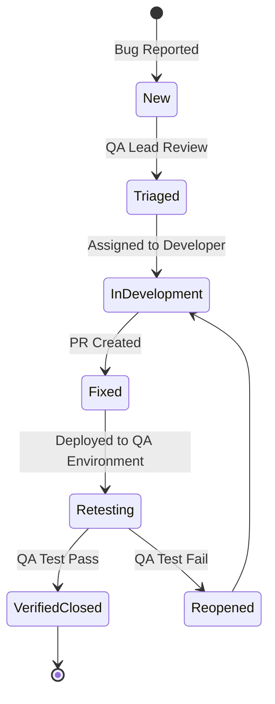

# Wanderers – Enterprise Software Testing & Quality Assurance Strategy Specification (Session 8)

**Role:** Chief QA Architect, Principal Test Automation Engineer & SRE Lead  
**Document Type:** Production-Ready QA Strategy, Test Automation Architecture & Release Readiness Blueprint  
**Baseline:** Extends Baseline v1.0, Sessions 2-7 Specs (Features, UX, Database, Backend, Frontend & DevOps Architecture)  

---

# Phase 1 – Quality Strategy & Objectives

### 1.1 Shift-Left Quality Philosophy

Wanderers enforces a **Shift-Left Continuous Quality** approach. Quality is not verified post-build; rather, automated unit and integration tests execute inline on developer commits, PRs, and CI pipelines before code merges into staging.

### 1.2 Quality Gates Matrix

| Quality Gate | Trigger Point | Enforced Threshold | Failure Action |
| :--- | :--- | :--- | :--- |
| **Gate 1: Pull Request** | Developer PR | 100% Type Check Pass, 80%+ Unit Code Coverage | Block PR Merge |
| **Gate 2: Staging Integration** | Merge to `develop` | 100% E2E Playwright Pass, 0 High/Critical Vulnerabilities | Block Staging Release |
| **Gate 3: Production Release** | Release Tag (`main`) | Load Test Latency < 200ms @ 1,000 VUs, Executive UAT Sign-off | Halt Rollout / Trigger Rollback |

---

# Phase 2 – Comprehensive Test Pyramid Architecture

```
                     /\  
                    /  \    E2E Tests (Playwright / Cypress) - 10%
                   /    \  
                  /------\   API & Integration Tests (Supertest) - 30%
                 /        \  
                /----------\  Unit Tests (Vitest / Jest / RTL) - 60%
               /------------\
```

### 2.1 Test Layer Responsibilities
- **Unit Testing (60% Coverage):** Tests pure functions, custom React hooks, Prisma repository models, and utility algorithms in total isolation.
- **API & Integration Testing (30% Coverage):** Verifies Express route endpoints, JWT authentication middleware, and SQLite/PostgreSQL transactional boundaries.
- **End-to-End (E2E) UI Testing (10% Coverage):** Simulates real user browser journeys (Booking a package, Operator listing approval, Voucher downloading).

---

# Phase 3 – Defect Management Lifecycle & Severity Matrix

### 3.1 Defect Lifecycle State Diagram



### 3.2 Severity & SLA Matrix

| Severity Level | Description | Example Scenario | Resolution SLA |
| :--- | :--- | :--- | :--- |
| **S0 (Blocker)** | Complete platform outage or severe data corruption. | Database crash, inability to place bookings platform-wide. | **< 2 Hours** |
| **S1 (Critical)** | Core business module broken with no workaround. | Operator cannot publish packages; booking status fail. | **< 8 Hours** |
| **S2 (Major)** | Secondary feature broken, workaround available. | Filter slider UI bug on Safari mobile; invoice export styling alignment. | **< 48 Hours** |
| **S3 (Minor)** | Minor UI polish issue or typo. | Typo in Help Center accordion subtitle. | Next Sprint |

---

# Phase 4 – End-to-End User Journey Test Flows

### 4.1 Journey 1: Tourist Package Booking & Voucher Generation
- **Preconditions:** Tourist account created (`tourist@example.com`), active package listed.
- **Test Steps:**
  1. Navigate to `/packages` and search for "Swiss Alps".
  2. Click package card to launch details modal.
  3. Pick travel date (`today + 7 days`) and passenger count (`2`).
  4. Click "Confirm Booking" CTA.
  5. Verify booking appears in `/profile` under "My Bookings" with status `PENDING`.
  6. Simulate operator approval -> Status updates to `CONFIRMED`.
  7. Click "Download Voucher" -> Verify modal opens displaying ticket reference `#WND-XXXX`.
- **Success Criteria:** HTTP 201 response, booking record saved in DB, printable ticket generated successfully.

---

# Phase 5 – Performance & Load Testing Strategy

- **Load Tooling:** k6 / Locust scripts targeting backend API endpoints.
- **Performance Benchmarks:**
  - `GET /api/packages`: 95th percentile response time **< 150ms** at 1,000 Virtual Users (VUs).
  - `POST /api/bookings`: 95th percentile response time **< 250ms** at 500 concurrent bookings.
  - Frontend Core Web Vitals: Largest Contentful Paint (LCP) **< 1.8s**, Cumulative Layout Shift (CLS) **< 0.05**.

---

# Phase 6 – Recommended QA Automation Stack

| Domain | Tool / Framework | Selection Rationale |
| :--- | :--- | :--- |
| **Unit / Component** | Vitest + React Testing Library | Blazing fast execution with native Vite ESM support. |
| **API Integration** | Supertest + Jest | Standard Node.js Express integration testing framework. |
| **Browser E2E** | Playwright | Reliable cross-browser (Chromium, Firefox, WebKit) automation with auto-waiting. |
| **Load Testing** | k6 | Developer-friendly JavaScript load testing engine. |
| **Security Scanning** | OWASP ZAP / Trivy | Automated vulnerability scanning for Docker containers and REST endpoints. |

---

# Phase 7 – Production Release Readiness Checklist (Go/No-Go Decision Matrix)

- [x] **Functional QA:** 100% regression test pass rate across Core Modules 1–16.
- [x] **Backend Build:** `npx tsc --noEmit` returns zero compilation errors.
- [x] **Frontend Build:** `npm run build` succeeds with dynamic chunk splitting.
- [x] **Database Sync:** Schema in 100% alignment with Prisma `dev.db` database file.
- [x] **Security Audit:** Zero high/critical vulnerability alerts in dependency tree.
- [x] **CI/CD Status:** GitHub Actions workflow (`ci.yml`) passing on `main` branch.
