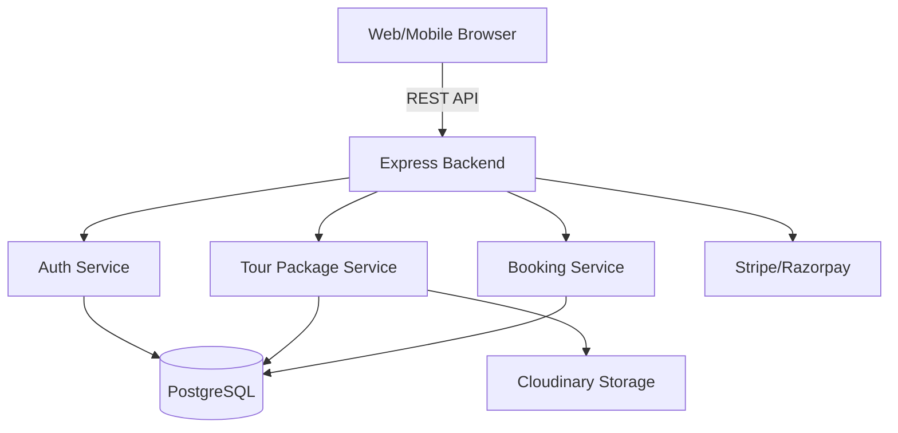
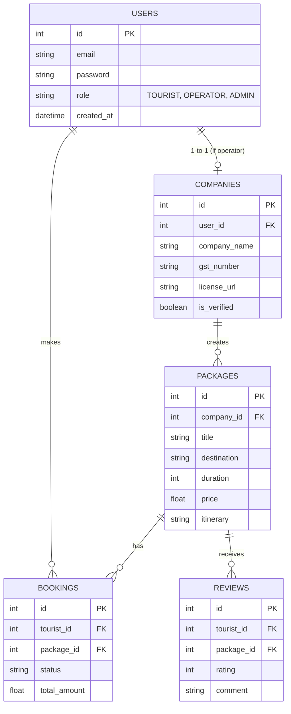

# Wanderers Marketplace - System Design & Product Specification

Wanderers is a marketplace platform connecting Tourists and Tour Package Companies.

---

## 1. System Architecture

**Frontend Architecture:**
- **Framework:** React + TypeScript (Vite/Next.js).
- **Styling:** TailwindCSS with Shadcn UI and Framer Motion for glassmorphic, premium UI.
- **State Management:** Redux Toolkit (global state like Auth), React Query (server state & caching).
- **Routing:** React Router / Next.js App Router.

**Backend Architecture:**
- **Framework:** Node.js with Express (MVC pattern).
- **Language:** TypeScript.
- **Database:** PostgreSQL.
- **ORM:** Prisma.
- **File Storage:** Cloudinary (images, PDFs, videos).
- **Auth:** JWT and Google OAuth.

**Deployment & Infrastructure:**
- Docker for containerization.
- AWS (EC2/RDS) or Vercel/Render for hosting.

### High-Level Architecture Diagram


---

## 2. Database Schema (ER Diagram)



---

## 3. Feature Breakdown

### Feature 1: Tour Operator Onboarding & Package Management
**Business purpose:** Allow legitimate travel companies to list their offerings, driving the supply side of the marketplace.
**User story:** As a Tour Operator, I want to register my company and upload my GST/License, so that I can get verified and start publishing packages.
**Acceptance criteria:**
- Operators can register and upload PDFs/Images of their business licenses.
- Super Admin must approve before packages go live.
- Operators can CRUD their tour packages (Images, itinerary, price, hotel).
**UI wireframe description:** A premium dashboard with a glassmorphic sidebar. The "Add Package" form is a multi-step wizard (Details -> Itinerary -> Media -> Pricing).
**API endpoints:**
- `POST /api/operators/register`
- `POST /api/packages` (Requires Auth: OPERATOR)
- `PUT /api/packages/:id`
- `DELETE /api/packages/:id`
**Validation rules:** GST number must match regex format; images must be <5MB.
**Security considerations:** Operators can only edit/delete packages linked to their `company_id`.
**Scalability considerations:** Implement pagination for operators with hundreds of packages.

### Feature 2: Tourist Discovery & Booking
**Business purpose:** Enable users to easily discover and pay for trips, generating commission revenue.
**User story:** As a Tourist, I want to filter packages by destination and budget, so I can find and book my ideal honeymoon.
**Acceptance criteria:**
- Home page shows featured and trending packages.
- Powerful search with filters (budget, duration, category).
- Payment gateway integration for immediate booking.
**UI wireframe description:** Airbnb-style search bar at the top (Where to? When? Who?). Beautiful image-heavy cards with micro-animations on hover.
**API endpoints:**
- `GET /api/packages?destination=Bali&budgetMax=1000`
- `POST /api/bookings`
- `POST /api/payments/create-intent`
**Validation rules:** Travel date must be in the future; tourists cannot book unavailable dates.
**Security considerations:** Payment intents must be verified on the backend via Webhooks to prevent tampering.

### Feature 3: Super Admin Dashboard
**Business purpose:** Maintain platform quality, resolve disputes, and monitor revenue.
**User story:** As a Super Admin, I want to review pending company registrations to reject fake companies.
**Acceptance criteria:**
- Admin can approve/reject companies.
- Admin views overall revenue and commission statistics.
**UI wireframe description:** Data-heavy dashboard with charts (using Recharts or Chart.js) and data tables for users and companies.
**API endpoints:**
- `GET /api/admin/pending-companies`
- `POST /api/admin/verify-company/:id`

---

## 4. Folder Structure (Proposed)

```text
/Wanderers
  /client (React Frontend)
    /src
      /assets
      /components (Reusable UI components)
      /features (Domain-driven components, e.g., auth, packages, bookings)
      /hooks
      /pages (Page components)
      /services (API clients)
      /store (Redux state)
  /server (Express Backend)
    /src
      /controllers
      /middlewares
      /models (Prisma schema & client)
      /routes
      /services (Business logic)
      /utils
```

---

## 5. Future Improvements & AI Features
- **AI Recommendation Engine:** Use an ML model or OpenAI API to recommend packages based on a user's previous bookings and wishlist.
- **Microservices:** If traffic scales massively, extract the Booking and Payment logic into separate microservices.
- **Mobile Application:** Build a React Native app sharing the same backend REST API.
